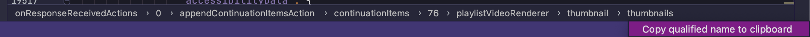

<h1 align="center">rjson</h1>

a jq like library for golang that helps parse nested json

```
go get github.com/ayes-web/rjson
```

## Parse nested json without any anonymous structs
```go
type Out struct {
	One     string      `rjson:"uwu.nya"`           // "123"
	Two     int         `rjson:"one.two.three.num"` // 1
	Three   []string    `rjson:"one.arr"`           // ["a","b"]
    Four    string      `rjson:"one.arr[0]"`        // "a"
}
```

```json
{
    "uwu": {
        "nya": "123"
    },
    "one": {
        "two": {
            "three": {
                "num": 1
            }
        },
        "arr": [
            "a",
            "b"
        ]
    }
}
```

For a more complete example have a look at `tag_test.go`

## Helpful

For quickly parsing json, in jetbrains IDE you can directly copy the json pointer and paste it into rjson field tag


output: ``onResponseReceivedActions[0].appendContinuationItemsAction.continuationItems[76].playlistVideoRenderer.thumbnail.thumbnails``


## Syntax explanation

### Path seperator: "."
- Dot symbol is used as path seperator, e.g `one.two.three`

### Array index: [0]
- You can index slices/array like you would normally, e.g `arr[0]`, `arr[1]`

### Last value: [-]
- You can access the last value of an slices/array using this, e.g `arr[-]`

### Value iterator: []

- e.g `arr[].text`

    #### Input
    ```json
	{
	    "arr": [
	        {
	            "text": "1",
	            "num": 1
	        },
	        {
	            "text": "2",
	            "num": 2
	        },
	        {
	            "no_commons": "this object has no common fields, so it wont be included"
	        }
	    ]
	}
    ```

    #### Output
    ```json
    [
        {
            "text": "1",
        },
        {
            "text": "2",
        }
    ]
    ```
